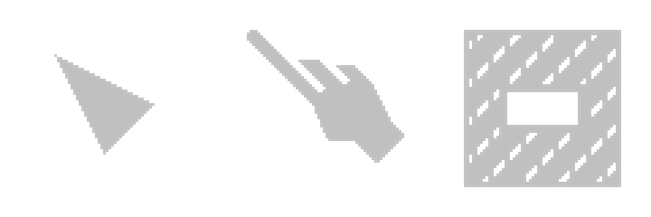

# Cursor

Lunex provides a custom abstraction for a cursor related features within your Bevy application.
This is achieved by moving all logic to a an entity that is spawned into the world.
It is required that you spawn this entity, otherwise picking won't work.

### Requirements

You need to spawn this bundle for native cursor to work

```rust
commands.spawn( CursorBundle::default() )
```

### Styled cursors

You can also attach custom image to your cursor entity. First, you will also need to have all the cursor icons in a image strip like this:



Then you can use `StyledCursorBundle` instead of `CursorBundle`.

```rust
commands.spawn(StyledCursorBundle {
    // Put texture atlas and sprite bundle here
    ..default()
})
```

Make sure you spawn `StyledCursorBundle` as a child of 2D `Camera`, otherwise the sprite would not follow the view.

### Gamepad support

To bind a cursor to a gamepad, you have to add this component:

```rust
GamepadCursor::new(0),
```

If you want the cursor to accept both Mouse and Gamepad inputs, you have to create an additional
system that listens to recent input events and based on them "removes" or "adds" this component.

Currently, there is only 1 mode supported and that is `Free` which means you just use your stick to move
the cursor around. There is no "jumping" yet.

However, it is planned to add `Snap` mode, which makes the cursor "jump" and snap to the next node in input direction.

## Example

Here's an example of how to set up a custom cursor with gamepad control:

```rust
// Spawn cursor
camera.spawn ((
    StyledCursorBundle {
        // Here we can map different native cursor icons to texture atlas indexes and sprite offsets
        cursor: Cursor2d::new()
            .set_index(CursorIcon::Default, 0, (14.0, 14.0))
            .set_index(CursorIcon::Pointer, 1, (10.0, 12.0))
            .set_index(CursorIcon::Grab, 2, (40.0, 40.0)),
        // Add texture atlas to the cursor
        atlas: TextureAtlas {
            layout: atlas_layout.add(TextureAtlasLayout::from_grid(UVec2::splat(80), 3, 1, None, None)),
            index: 0,
        },
        // Add sprite strip to the cursor
        sprite: SpriteBundle {
            texture: assets.load("cursor.png"),
            transform: Transform { scale: Vec3::new(0.45, 0.45, 1.0), ..default() },
            sprite: Sprite {
                color: Color::YELLOW.with_alpha(2.0),
                anchor: Anchor::TopLeft,
                ..default()
            },
            ..default()
        },
        ..default()
    },

    // Here we specify that the cursor should be controlled by gamepad 0
    GamepadCursor::new(0),
));
```
