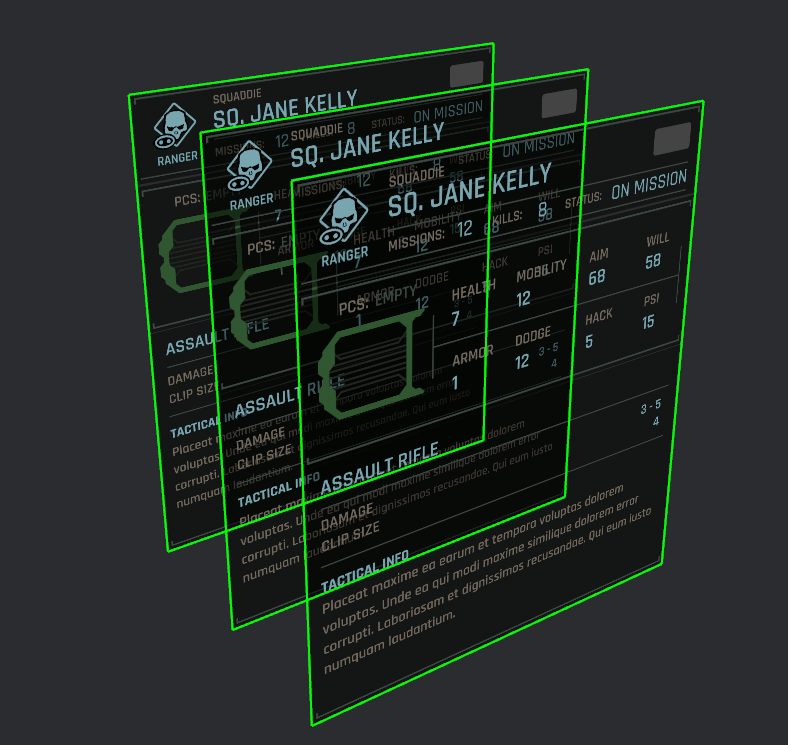

# Worldspace UI

Lunex in its entirety is built in worldspace.
This means every UI element is bound to a place in the game world.

You don't realize that, because when we are making a 2D game UI, we attach our UI to the Camera.

If we wish for our UI to be spawned at fixed place in the world, then just spawn it as normal entity.
This can be usefull for example if you want to create in-game displays, holograms and such.

### Images

For 3D images, you can take a look at this example: [worldspace example](https://github.com/bytestring-net/bevy_lunex/tree/main/examples/worldspace). You can use the built-in abstraction which just hides the fact that all what we are really doing is creating a material with our texture and then attaching it onto a plane.

### Text

3D text is currently limited and you have to use a 3rd party crate `bevy_mod_billboard`. You can take a look at how to integrate it here: [worldspace text example](https://github.com/bytestring-net/bevy_lunex/tree/main/examples/worldspace_text)

### Important

When we are spawning a 3D hologram, we don't want the size to be the size of our camera, but some custom fixed size.
You can achieve that by specifying the size in the `Dimension` component on `UiTreeBundle` when we are spawning our tree.
If you don't do that, your UI size will default to 0 and you won't see anything if you use `Rl` units.

Another thing to keep in mind is the difference in `abs_scale`. If you use `UiTree::new2d`, then the abs_scale is set to `1`. But if you use `UiTree::new3d` then the abs_scale is set to `0.001`. This is to create a sensible balance between sizes when going from 2d to 3d.

Because in 2D Bevy, `1.0` in `Transform` corresponds to 1 pixel on screen. But in 3D Bevy, `1.0` means `1 meter`. You can now see the problem. To make things easier to use, I decided that when you are working with 3D UI in Lunex, all `Ab` units are in **`centimeters`**.

